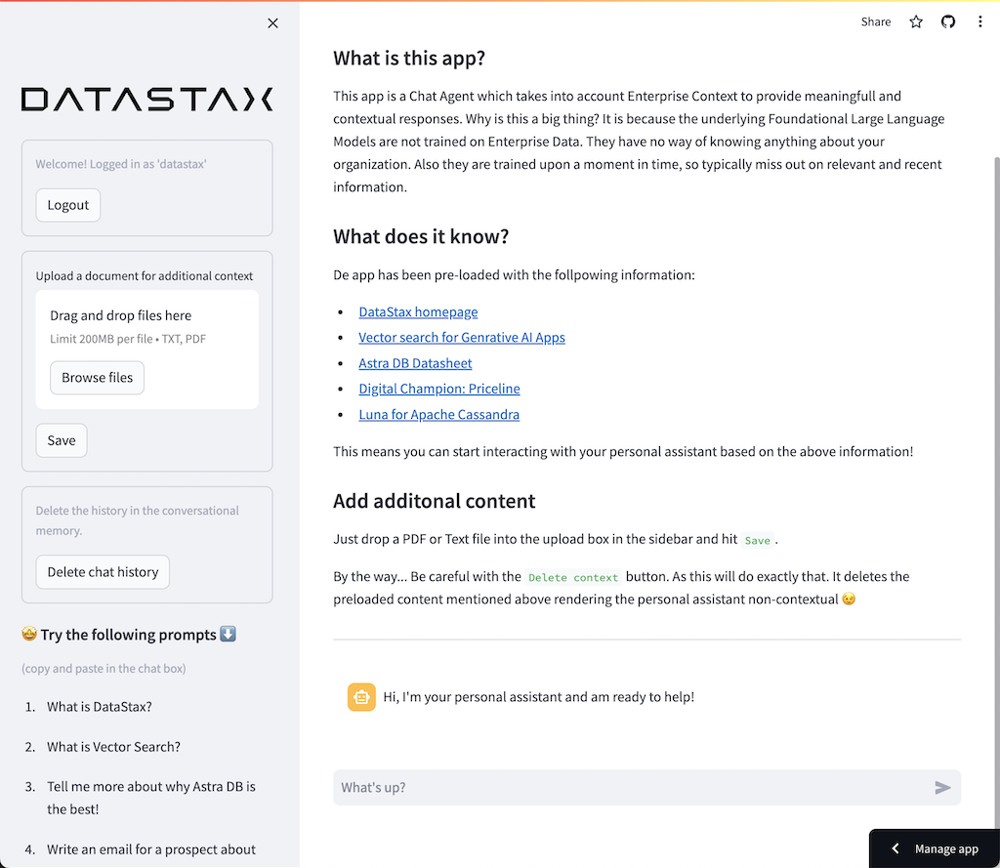
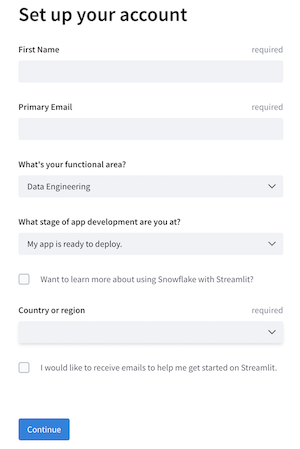

# Construye tu propio Chatbot con RAG
Bienvenido a este breve taller para desplegar tu propio Chatbot usando Retrieval Augmented Generation (RAG) o """Generación Aumentada por Recuperación""" con Astra DB y con el modelo de conversación de OpenAI.

Se aprovecha el uso de [DataStax RAGStack](https://docs.datastax.com/en/ragstack/docs/index.html), que es una colección del mejor software open-source para facilitar la implementación del patrón RAG en aplicaciones lista para producción, las cuales usen Astra Vector DB o Apache Cassandra como almacenamiento vectorizado.



Que queremos aprender:
- Como aprovechar [DataStax RAGStack](https://docs.datastax.com/en/ragstack/docs/index.html) para usar a nivel productivo los siguientes componenetes:
    - El almacenamiento vectorial de [Astra DB Vector Store](https://db.new) para búsqueda de Similaridad Semántica
    - [LangChain](https://www.langchain.com) para vincular OpenAI y Astra DB
- Cómo usar [modelos LLM OpenAI](https://platform.openai.com/docs/models) para chatbots de consulta y respuestas (OpenAI's Large Language Models)
- !Como usar [Streamlit](https://streamlit.io) para desplegar facilmente tu app al internet para que cualquiera pueda usarla! 

## 1️⃣ Prerequisitos
Se asume que ya se tiene acceso a: 
1. [Una cuenta Github](https://github.com)

Adicionalmente se crearán accesos de forma gratuita a los siguientes sistemas:
1. [DataStax Astra DB](https://astra.datastax.com) (se puede crear una cuenta a través de Github)
2. [OpenAI account](https://platform.openai.com/signup) (se puede crear una cuenta a través de Github)
3. [Streamlit](https://streamlit.io) to deploy your amazing app (se puede crear una cuenta a través de Github)

Recuerda tener a mano el **Astra DB API Endpoint**, el token **Astra DB ApplicationToken** y la llave **OpenAI API Key**, se usarán más adelante donde se indique.


### Registro en Astra DB
Debes crear una basde de datos de vector (vector-capable) de Astra (puedes obtener una gratis en [astra.datastax.com](https://astra.datastax.com))
- Necesitarás tener el **API Endpoint** que puedes encontrar en el panel derecho en *Database details*.
- Asegurate de obtener un token **Application Token** para tu base de datos, que también puede obtenerse en panel derecho debajo de *Database details*.


### Registo en OpenAI
- Crea una [cuenta OpenAI](https://platform.openai.com/signup) or [entra](https://platform.openai.com/login).
- Navega a la página [API key page](https://platform.openai.com/account/api-keys) y crea una nueva **Secret Key** (llave secreta), opcionalemente puedes darle un nombre a la llave.


### Registro en Streamlit
Sigues los pasos en [here](https://docs.streamlit.io/streamlit-community-cloud/get-started/quickstart).


## 2️⃣ Abrir este tutorial en Github Codespaces
Para facilitar las cosas usaremos la fabulosa funcionalidad de Codespace. Github ofrece un experiencia de desarrollo completamente integrada y recursos para comenzar rapidamente: 

1. Abre el repositorio [chatbot-rag-agent](https://github.com/michelderu/build-your-own-rag-agent)
2. Haz click en `Use this template`->`Ceate new repository` como se muestra:

    

3. Selecciona tu propia cuenta de github y pon un nombre al nuevo repositorio. Puedes colocar idealmente una descripción. Haz click en `Create repository`

    

4. !Genial! ¡Creaste una copia en tu propia cuenta de Gihub! Ahora a empezar, haz click en `Create codespace on main`:

    

¡Estás listo para codificar! 🥳  
Codespaces crea tu entorno de desarrollo basado en  `Python 3.11`, automaticamente instalará las dependencias de Python a partir del archivo `requirements.txt`. Así que no es necesario hacer nada con `pip install`. También establecera automaticamente el manejo de puertos para poder entrar a apps de Streamlit posteriormente.
Cuando el codespace arraca ejecutara una app de Streamlit, Hello World, que te mostrará algunas de las fabulosas capacidades de este framework para UI. Cuando termines de examinarla, simplemente presiona `ctrl-c` en la `terminal` para detenerla.

## 3️⃣ Comenzar a construir una app con Streamlit

Construiremos una aplicación con la siguiente arquitectura general:


Usaremos Streamlit que un framework sorprendentemente fácil de usar para crear el front-end de aplicaciones web.

Lo primero es importar el paquete de streamlit. Llamamos a `st.title` para escribir un título para la página web, finalmente escribimos un poco de contenido markdown para la página usando `st.markdown`.

```python
import streamlit as st

# Draw a title and some markdown
st.title("Soporte para la eficiencia personal")
st.markdown("""La Inteligencia Artificial Generativa se considera como el motore de la siguiente revolución industrial.  
¡Los estudios recientes muestran alrededor de **37% de mejora** en la realización del trabajo diario!""")
```

## 4️⃣ Interface del chatbot

El siguiente paso sería preparar nuestra app para permitir la interacción como un bot con el usuario. Usamos los siguientes componentes de Streamlit: 

123. `st.chat_input` para permitir que el usuario escriba una pregunta
129. `st.chat_message('human')` para dibujar la entrada del usuario 
133. `st.chat_message('assistant')` para dibujar la respuesta del chatbot

## 5️⃣ Interacción con el chatbot

 Streamlit ejecuta el código cada vez que el usuario interactua con la app, por esa razón debemos usar caching the datos y recursos dentro de Streamlit, por ejemplo para que una conección se establezca una única vez. 
 
 Necesitamos guardar la interacción para que en cada redibujado la historia se muestre correctamente.

Para lograrlo hacemos los siguientes pasos:

126. La pregunta se almacena dentro de `st.session_state` en `messages`
146. Almacenamos la respuesta dentro de `st.session_state` en `messages`
119. Cuando la app redibuja, despliega en pantalla toda la historia con un ciclo `for message in st.session_state.messages`

Este manejo funciona porque `session_state` es stateful, o sea guarda su estado, a lo largo la ejecución de Streamlit.

Puede notarse que usarmos un diccionario para almacenar tanto al `role` (que puede ser humano o IA) como pregunta o la respuesta ( `question` or `answer`).

Usaremos `@st.cache_data()` y `@st.cache_resource()` para definir el caching. `cache_data` es tipicamente usado para estructuras de datos; `cache_resource` es usado principalmente para los recursos como bases de datos. Además almacenaremos como recurso la llamada al LLM:

```python
# Cache prompt for future runs
@st.cache_data()
def load_prompt():
    template = """You're a helpful AI assistent tasked to answer the user's questions.
You're friendly and you answer extensively with multiple sentences. You prefer to use bulletpoints to summarize.

CONTEXT:
{context}

QUESTION:
{question}

YOUR ANSWER:"""
    return ChatPromptTemplate.from_messages([("system", template)])
prompt = load_prompt()

# Cache OpenAI Chat Model for future runs
@st.cache_resource()
def load_chat_model():
    return ChatOpenAI(
        temperature=0.3,
        model='gpt-3.5-turbo',
        streaming=True,
        verbose=True
    )
chat_model = load_chat_model()
```

## 6️⃣ Ahora lo más cool! Integración con el modelo conversacional de OpenAI

La llamada a la "cadena" o Chain se realiza de la siguiente forma:

```python
# Generate the answer by calling OpenAI's Chat Model
inputs = RunnableMap({
    'question': lambda x: x['question']
})
chain = inputs | prompt | chat_model
response = chain.invoke({'question': question})
answer = response.content
```

Sin embargo, antes de poder continuar, necesitamos proveer la llave de OpenAI (`OPENAI_API_KEY`) en `./streamlit/secrets.toml`. Hay un ejemplo en `secrets.toml.example`:

```toml
# OpenAI secrets
OPENAI_API_KEY = "<YOUR-API-KEY>"
```
## 7️⃣ Conectar con the Astra DB Vector Store para agregar contexto

Hasta este punto lo que aún hace falta revisar en la integración con la base de datos vectoria, Astra DB Vector store, para que podamos tener respuestas contextualizadas. Al integrar nuestra app con Astra DB Vector Store podemos proveer contexto en tiempo real para el modelo conversacional del LLM. Los pasos para implementar RAG (Retrieval Augmented Generation) son: 
1. El usuario hace una pregunta
2. Una búsqueda por similaridad semántica se ejecuta en Astra DB Vector Store
3. El contexto recuperado se provee al Promt para el modelo conversacional
4. El modelo conversacional regresa una respuesta, que toma en cuenta el contexto recuperado

Para lograr estos pasos, debemos primero establecer una conección a nuestra Astra DB Vector Store:

```python
# Cache the Astra DB Vector Store for future runs
@st.cache_resource(show_spinner='Connecting to Astra')
def load_retriever():
    # Connect to the Vector Store
    vector_store = AstraDB(
        embedding=OpenAIEmbeddings(),
        collection_name="my_store",
        api_endpoint=st.secrets['ASTRA_API_ENDPOINT'],
        token=st.secrets['ASTRA_TOKEN']
    )

    # Get the retriever for the Chat Model
    retriever = vector_store.as_retriever(
        search_kwargs={"k": 5}
    )
    return retriever
retriever = load_retriever()
```

Lo único que faltaría es que la cadena o Chain para incluir la llamada al almacenamiento vectoriol:

```python
# Generate the answer by calling OpenAI's Chat Model
137. inputs = RunnableMap({
138.    'context': lambda x: retriever.get_relevant_documents(x['question']),
139.    'question': lambda x: x['question']
140. })
```

Para terminar, debemos tener el endpoint de nuestra base de datos y su token de seguridad, `ASTRA_API_ENDPOINT` y `ASTRA_TOKEN`, los cuales colocaremos en `./streamlit/secrets.toml`.

```toml
# Astra DB secrets
ASTRA_API_ENDPOINT = "<YOUR-API-ENDPOINT>"
ASTRA_TOKEN = "<YOUR-TOKEN>"
```

## 8️⃣ Hacer que la aplicación tenga streaming

Sería muy interesante que la respuesta vaya apareciendo en la pantalla conforme está siendo generada. Bueno eso es sencillo! 

Es necesario crear un Call Back de Streaming que se llame en la generación de cada token:  

```python
# Streaming call back handler for responses
15. class StreamHandler(BaseCallbackHandler):
16.     def __init__(self, container, initial_text=""):
17.         self.container = container
18.         self.text = initial_text
19. 
20.     def on_llm_new_token(self, token: str, **kwargs):
21.         self.text += token
22.         self.container.markdown(self.text + "▌")
```

Y solicitamos al modelo conversacional que haga uso del StreamHandler:

```python
142. response = chain.invoke({'question': question}, config={'callbacks': [StreamHandler(response_placeholder)]})
```

El `response_placeholer` en el código de arriba define el lugar donde los tokens se escribirán. Ese espacio está creado llamando `st.empty()` como sigue:

```python
# UI placeholder to start filling with agent response
133. with st.chat_message('assistant'):
134.     response_placeholder = st.empty()
```

Con esto podemos ver la respuesta siendo escrita en tiempo real en la ventana del navegador.

## 9️⃣ Ahora agregamos el contexto adicional

La meta final es que podamos agregar el contexto de nuestra compañía al agente de chat. Para lograr esto, agregamos un control para subir archivos de tipo PDF, los cuales serán usados para regresar una respuesta significativa y con contexto!

El formado para subir el archivo es fácil de crear en Streamlit:

```python
110. # Include the upload form for new data to be Vectorized
111. with st.sidebar:
112.     with st.form('upload'):
113.         uploaded_file = st.file_uploader('Upload a document for additional context', type=['pdf'])
114.         submitted = st.form_submit_button('Save to Astra DB')
115.         if submitted:
116.             vectorize_text(uploaded_file)
```

Usamos una función para cargar el PDF y hacer la ingesta en Astra DB a la misma vez que se vectoriza su contenido.

```python
# Function for Vectorizing uploaded data into Astra DB
def vectorize_text(uploaded_file, vector_store):
    if uploaded_file is not None:
        
        # Write to temporary file
        temp_dir = tempfile.TemporaryDirectory()
        file = uploaded_file
        temp_filepath = os.path.join(temp_dir.name, file.name)
        with open(temp_filepath, 'wb') as f:
            f.write(file.getvalue())

        # Load the PDF
        docs = []
        loader = PyPDFLoader(temp_filepath)
        docs.extend(loader.load())

        # Create the text splitter
        text_splitter = RecursiveCharacterTextSplitter(
            chunk_size = 1500,
            chunk_overlap  = 100
        )

        # Vectorize the PDF and load it into the Astra DB Vector Store
        pages = text_splitter.split_documents(docs)
        vector_store.add_documents(pages)  
        st.info(f"{len(pages)} pages loaded.")
```

## 1️⃣0️⃣ Probemos nuestro agente con RAG!

Para ejecutar nuestra aplicación, debemos introducir la siguiente instrucción en la consola:
```bash
streamlit run app_chat.py
```

Si hay todavía está ejecutandose alguna aplicación, sólo hay que detenerla con `ctrl-c` antes de ejecutar nuestra nueva app.

En la ventana del navegador embedido veremos la UI de nuestro chatbot. Ahora debemos cargar un documento PDF, o varios, cuantos más mejor; los cuales sean relevantes, para comenzar a hacer preguntas acerca del tema. ¡Verás que las respuestas serán más relevantes, asi como con mayor sentido y contexto!


## 1️⃣1️⃣ Finalmente hay que desplegar nuestra app a la nube de Streamlit!

El último paso es desplegar nuestra fantástica aplicacón al Internet para que otros puedan ver tu trabajo y su funcionalidad. 

### Crea tu cuenta de Streamlit 
Si no lo has hecho anteriormente, crea y configura una cuenta en Streamlit:

1. Ve a [Streamlit.io](https://streamlit.io) y haz click en `Sign up`. Luego selecciona `Continue with Github`:

    

2. Accesa usando tus credenciales de GitHub:

    

3. Dale autorizatión a Streamlit:

    

4. Y configura tu cuenta:

    

### Despliega tu app

En la pantalla principal, una vez adentro, haz click en `New app`.

1. Cuando se trate de tu primer despliegue, deberás proveer permisos adicionales:

    

2. Ahora define la configuración de tu aplicación. Usar el nombre de tu repositorio, y la ruta de tu archivo principal como `app_chat.py`. Selecciona una URL de app interesante, pues la aplicación será desplegada en esa ruta: 

    

3. Haz click en Advanced, selecciona Python 3.11 y, copia y pega el contenido de tu archivo `secrets.toml`.

Haz click en Deploy! Espera unos instantes y tu app estará en línea para todos! 

⛔️ Toma en cuenta y se pruedente con el hecho de es una app pública que ocupa tu cuenta de OpenAI, lo que generará costos. Probablemente querrás escudar tu app haciendo click en `Settings->Sharing` en la pantalla principal y definir algunas direcciones de correo electrónicoo a las que se les permita el acceso. Para habilitar esta opción, debes asociar tu cuenta de Google. 


